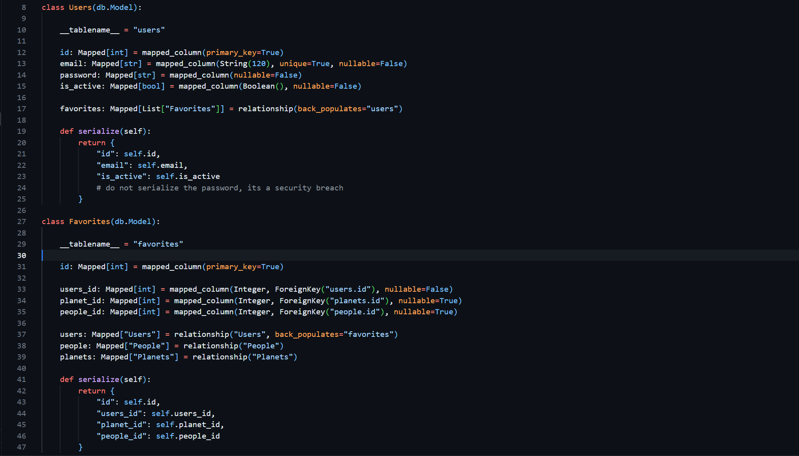

English | [Español](README.es.md)

# Star Wars REST API (Flask)

[](https://www.python.org/)
[](https://flask.palletsprojects.com/)
[](https://www.sqlalchemy.org/)

<br>

> **⚠️ Note:** This is a legacy backend learning project developed during my Full Stack Developer bootcamp at **4Geeks Academy**. It focuses on RESTful API design, relational database modeling, and server-side logic with Python.

<br>

A backend built with **Python** and **Flask** to manage a Star Wars blog database. It handles users, characters, planets, and a personalized favorites system through a relational architecture and SQLAlchemy ORM.

<br>

## Backend Implementation

The database is structured around **Users**, **People**, **Planets**, and **Favorites**, utilizing a Many-to-Many relationship logic. Below is a snippet of the relational models and serialization logic:



<br>

## Technologies & Tools

- Python
- Flask 
- Flask-SQLAlchemy 
- Pipenv

<br>

## Installation

1. Clone the repository:
   ```bash
   git clone [https://github.com/Antonio-Borrero/starwars-rest-api.git](https://github.com/Antonio-Borrero/starwars-rest-api.git)
   ```
2. Install dependencies:
   ```bash
   pipenv install
   ```
3. Initialize Database & Migrations:
    ```bash
   pipenv run init
   pipenv run migrate
   pipenv run upgrade
   ```
4. Run the server:
   ```bash
   pipenv run start
   ```

<br>

## Learning Outcomes

- **Relational Database Design:** Built Entity-Relationship models and handled relationships (One-to-Many/Many-to-Many).
- **Backend Workflow:** Learned the cycle of model updates, migrations, and endpoint testing using Postman.
